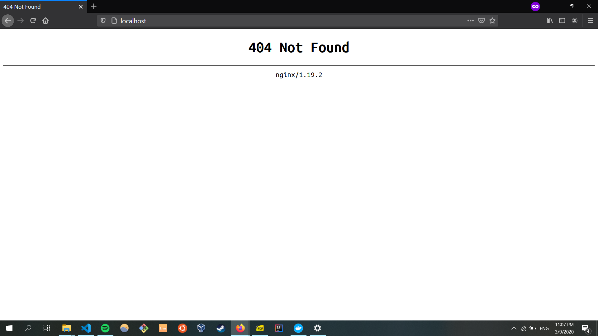

# Task A

Deploy a simple web server using Nginx running in a Docker container.

There are 2 containers (`webservice-1` and `webservice-2`) running with a reverse proxy server (`proxy`). All 3 containers are running `nginx`.

You can visit `webservice-1` at `localhost/webservice-1` and `webservice-2` at `localhost/webservice-2`.

Visiting `localhost` will result in a 404 error.

# Running the reverse proxy server and the 2 webservices

1. Clone this repository, navigate to the `task-a` directory using `cd task-a`
1. Ensure that Docker is running on your machine
1. Change directory (cd) to `webservice-1` and run `docker-compose up --build -d`
1. Change directory (cd) to `webservice-2` and run `docker-compose up --build -d`
1. Change directory (cd) to `proxy` and run `docker-compose up --build`
1. Open a browser and navigate to `localhost/webservice-1` to view the homepage of `webservice-1`
1. Change the URL to `localhost/webservice-2` to view the homepage of `webservice-2`
1. A 404 error will be returned by nginx when you visit `localhost/`

You can stop running all Docker containers by executing the command `docker kill $(docker ps -q)`

# Screenshots of running server

Running containers in Docker

Visiting `localhost`

Visiting `localhost/webservice-1`

Visiting `localhost/webservice-2`

# Cleanup (Warning: Removing ALL containers/images)

1. Removing ALL Docker images

   `docker rmi $(docker images -q)`

1. Removing ALL Docker containers

   `docker rm $(docker ps -a -q)`

# References

1. docker-compose up
   https://docs.docker.com/compose/reference/up/

1. What is a reverse proxy?
   https://www.cloudflare.com/learning/cdn/glossary/reverse-proxy/

1. Default server indication in conf file
   http://nginx.org/en/docs/http/request_processing.html

1. Docker compose : NGINX reverse proxy with multiple containers
   https://www.bogotobogo.com/DevOps/Docker/Docker-Compose-Nginx-Reverse-Proxy-Multiple-Containers.php

1. Proxy pass to another container https://stackoverflow.com/questions/45717835/docker-proxy-pass-to-another-container-nginx-host-not-found-in-upstream
