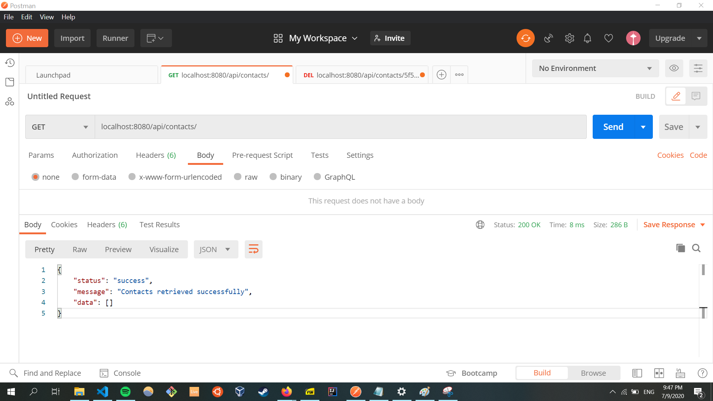
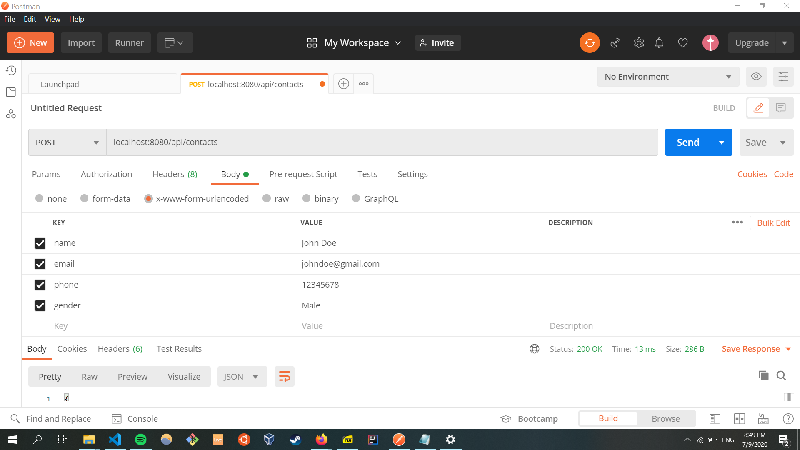
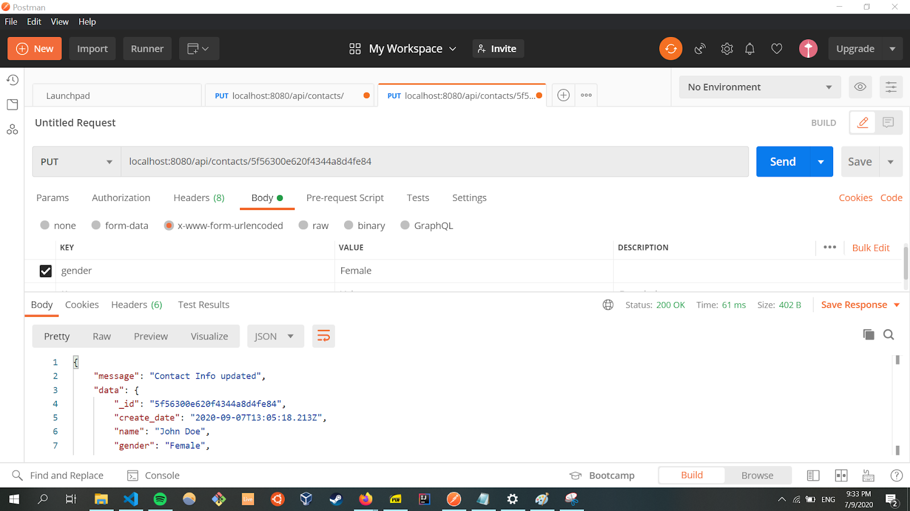
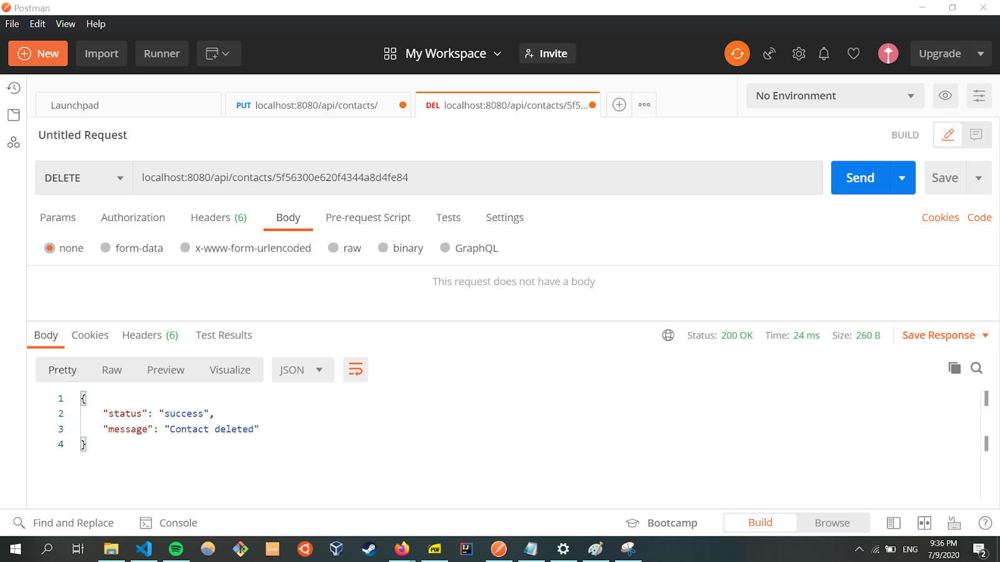

# Task B1

Implement a simple JavaScript backend and REST API to GET, POST, PUT, DELETE.

This repo contains a contacts API that allows for the creation, retrieval, updating and deletion of contacts. It runs on localhost.

The API uses Node.js, MongoDB and Postman.

# Running the API

1. Ensure that [Node.js](https://nodejs.org/en/), [MongoDB](https://www.mongodb.com/try/download/community) and [Postman](https://www.postman.com/downloads/) are installed
1. Clone this repository at https://github.com/JeremyLoh/self-paced-tasks
1. Open a terminal and navigate to the `task-b1/contacts` directory using the `cd` command
1. Run `npm install`. This will install all dependencies required to run the API
1. Run `mongod` on the terminal to start MongoDB
1. Run `nodemon index.js` to start the application

# How the API is structured

The database schema contains the following:

1. `name` of type String
1. `email` of type String
1. `gender` of type String
1. `phone` of type String
1. `create_date` of type Object containing a type Date and a default value of `Date.now`

In the database schema, `name` and `email` are compulsory!

There are 3 main URLs for the API:

1. `localhost:8080/api`: this is the root directory of the API and a JSON object will be returned containing a status of `API is working` and message of `hello`.
1. `localhost:8080/api/contacts`: this route has 2 possible requests (GET and POST). The GET request is used to obtain all contacts that are present in the database. The POST request can be used to create a new contact entry in the database.
1. `localhost:8080/api/contacts/:contact_id`: this route has 4 possible requests (GET, PATCH, PUT, DELETE). The `:contact_id` is a contact id assigned to a contact record in the database. These can be viewed by doing a GET request to `localhost:8080/api/contacts`. The GET request is used to obtain information about the specified contact id record. The PATCH and PUT request is used to update a given contact id record in the database. The DELETE request is used to remove the specified contact id record from the database.

# Testing the API

This can be done by using [Postman](https://www.postman.com/downloads/).

To submit a `GET` request to the API

1. Open a new tab in Postman and select GET request. An example is shown below:
   

To submit a `POST` request to the API

1. Select POST request in Postman and enter the appropriate key value pairs (based on the database schema). The key value pairs are placed under `Body` in `x-www-form-urlencoded` form. An example is shown below:
   

To submit a `PUT` request to the API

1. Select PUT request in Postman and enter the appropriate key value pairs (based on the database schema). The key value pairs are placed under `Body` in `x-www-form-urlencoded` form. An example is shown below:
   

To submit a `DELETE` request to the API

1. Select DELETE request in Postman and enter the contact id to be deleted in the URL `localhost:8080/api/[contact_id]`. The `contact_id` can be obtained by viewing all contacts using a GET request to `localhost:8080/api/contacts` and using the value in the `_id` key. An example is shown below:
   
