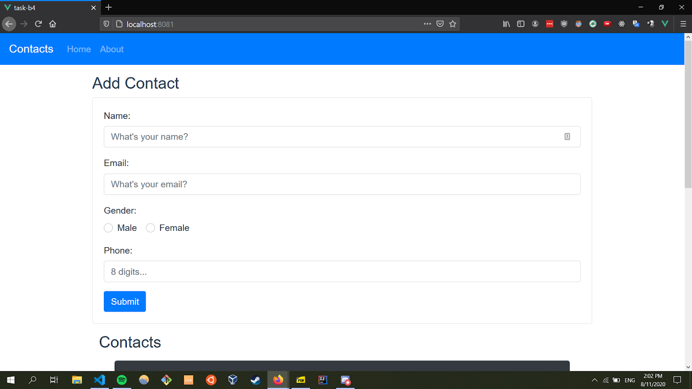
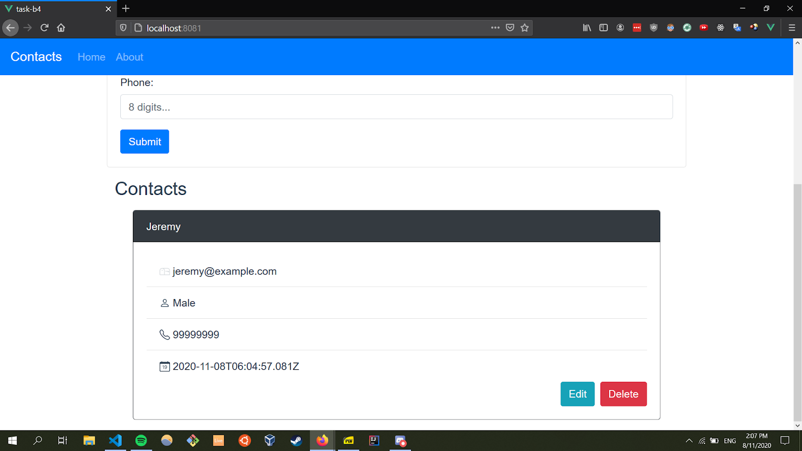
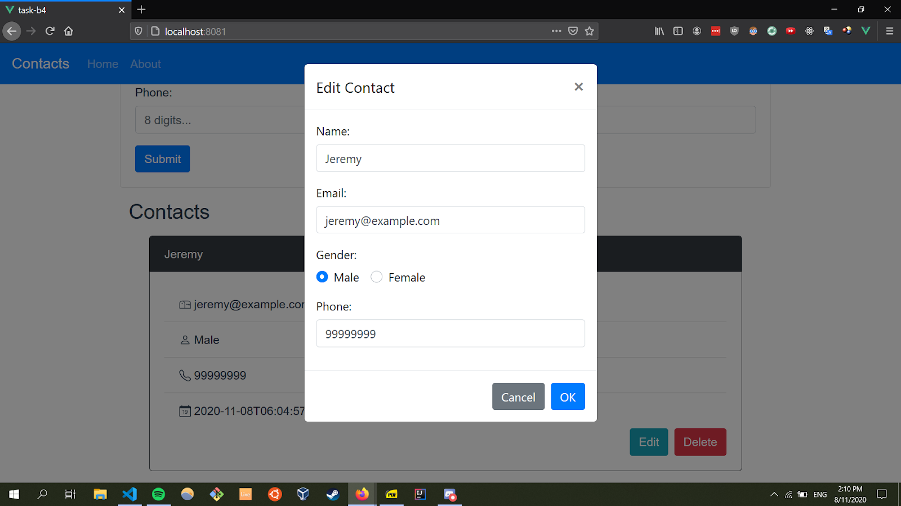
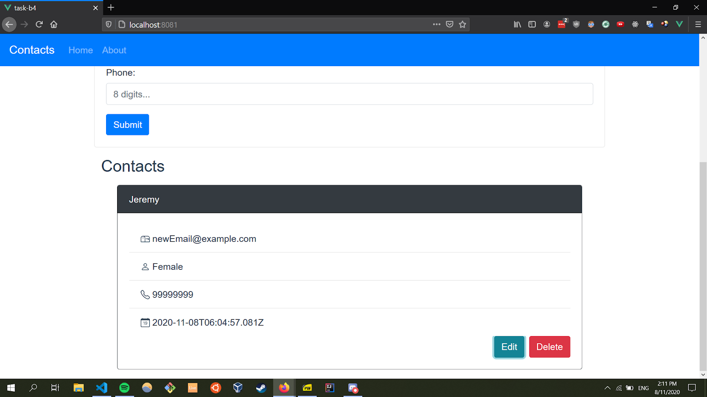

# task-b4

Build a frontend SPA using Vue or any other framework.

# Running the Application

The API is a contacts API that allows for creation, retrieval, updating and deletion of contacts. It runs on localhost.

Ensure that [Node.js](https://nodejs.org/en/), [MongoDB](https://www.mongodb.com/try/download/community) are installed.

1. Run the backend

   1. Ensure you are at the directory: `task-b4/src/api`
   1. Ensure MongoDB is running
   1. Run `npm i`
   1. Run `nodemon index.js`
   1. The backend should be running on port 8080

1. Open another terminal to run the frontend
   1. Change directory to `task-b4`
   1. Run `npm i`
   1. Run `npm run serve`

There are 2 pages: Homepage and About

You can add, edit, delete and view all contacts on the Homepage.

Whenever the Homepage is visited, all contacts in the database will be shown to you.

## Adding a new contact via form

## Updating an existing contact

A new modal will pop up that will allow you to edit the contact details.

An example change: modifying the contact's gender and email

The final updated contact!

# Deleting an existing contact

Deletion of any contact is done by pressing the delete button for each individual contact card!

# References

1. Cors issue with Vue.js: https://stackoverflow.com/questions/40863417/cors-issue-with-vue-js
1. vee-validate: https://logaretm.github.io/vee-validate/guide/rules.html#installing-all-rules
1. BootstrapVue: https://bootstrap-vue.org/docs
1. Vue passing data back to parent using \$emit: https://forum.vuejs.org/t/passing-data-back-to-parent/1201/2
1. Vuex crash course: https://youtu.be/5lVQgZzLMHc

### Customize configuration

See [Configuration Reference](https://cli.vuejs.org/config/).
